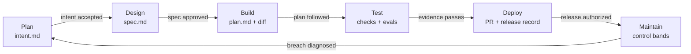

# The AI-Native SDLC Playbook

## Thesis

AI can produce code faster than most organizations can decide, review, and release it. That does not remove the software development lifecycle; it moves the bottleneck from typing code to expressing intent, applying policy, proving behavior, deciding risk, and learning from production.

An AI-native SDLC therefore changes the unit of coordination. The unit is not a chat transcript or an agent session. It is a version-controlled artifact that a person and an agent can both read.

Each stage consumes the accepted artifact from the prior stage, produces its own evidence, and stops at a named gate. Agents do the scalable work: synthesis, inspection, implementation, verification, triage, and repetition. Humans retain the judgment work: choosing outcomes, resolving ambiguity, accepting risk, approving releases, and owning production.

The goal is not autonomous software delivery without people. The goal is a delivery loop in which human attention is spent on decisions rather than reconstruction and mechanical checking.

This repository implements the ideas in [Anthropic's AI-Native SDLC playbook](https://claude.com/blog/the-ai-native-sdlc-playbook) as a concrete artifact contract.

## The loop



The diagram is a loop, not a promise that every change takes the same route. A low-risk documentation correction may enter at Build. A production anomaly may enter at Maintain and create a new Plan artifact. A high-risk design may cycle between Plan and Design several times.

The invariant is that no stage invents acceptance on behalf of the next gate owner.

Each stage is executed by one skill in the `ai-sdlc` plugin: `sdlc-plan`, `sdlc-design`,
`sdlc-build`, `sdlc-test`, `sdlc-deploy`, `sdlc-maintain`. Two subagents serve them —
`sdlc-reviewer` for the Stage 5 review passes, `sdlc-diagnostician` for Stage 6 breach
diagnosis. The rest of this document describes the method; the skills are how it runs.

## Operating rules

1. Read the upstream artifact before doing stage work.
2. Keep one change in one `.sdlc/<slug>/` directory.
3. Treat artifact status as data, not decoration.
4. Record the human approver and approval time.
5. Do not approve an artifact you generated.
6. Put deterministic policy in hooks or CI, not only in prose.
7. Put repeatable institutional guidance in skills.
8. Attach tool output as evidence; do not replace it with a claim that checks passed.
9. Update the plan when implementation departs from it.
10. Feed escaped defects and incidents back into tests, evals, or instructions.

## Where files live

Per-change artifacts live together:

```text
.sdlc/<slug>/
├── intent.md
├── spec.md
└── plan.md
```

`<slug>` is a stable, short, lowercase, hyphenated change identifier. Do not reuse a slug for an unrelated change.

Repository-wide operating files live at the repository root:

```text
CLAUDE.md
REVIEW.md
bands.yaml
```

`CLAUDE.md` gives every session the same commands, architecture, conventions, and recurring corrections. `REVIEW.md` defines the review passes, severity threshold, exclusions, and evidence standard. `bands.yaml` defines deterministic production signals and the maximum action allowed at each response tier.

If Jira, ServiceNow, Figma, or another platform remains the official record, each Markdown artifact must name that record and the external record must contain the commit SHA or pull-request link. One system is authoritative for each fact, and cross-links are mandatory when two systems carry working copies.

## Stage 1: Plan

### What it is for

Plan captures a problem before it is diluted by tickets, meetings, and handoffs.

It records what cannot be done today, what observable result is wanted, who is affected, and which boundaries cannot move.

Plan is deliberately a proto-specification.

It describes the outcome without prematurely choosing implementation.

An idea can originate with a person, a customer report, an incident, a ticket, a scheduled scan, or a control-band breach.

Every origin uses the same artifact shape so Design receives a stable input.

### Agent responsibility

The agent interviews the originator in plain language.

It asks about affected users, present behavior, desired behavior, constraints, exclusions, evidence, and unresolved questions.

It challenges vague success language such as "better," "faster," or "secure" until the originator supplies something observable.

It writes the draft and points out contradictions.

It does not decide whether the idea is worth doing.

### Human responsibility

The originator corrects misunderstandings.

The product owner checks that the problem is real, the proposed outcome is valuable, and the scope is coherent.

Policy owners are consulted when a constraint needs interpretation.

The product owner accepts or rejects the intent.

### Contract artifact: `.sdlc/<slug>/intent.md`

Use this template verbatim:

```markdown
# Intent: [feature name]
Author: [name]. Status: draft.

<!-- State the customer or operator problem, not the implementation. Keep this under a page. -->
## Problem
[what customers cannot do today]

<!-- Describe the observable result and success condition. -->
## Proposed outcome
[what better looks like]

<!-- Name people, services, data stores, APIs, and operational systems affected. -->
## Affected users and systems
[who and what is impacted]

<!-- Include hard limits: compatibility, privacy, cost, reliability, and rollout requirements. -->
## Constraints
[limitations or requirements]

<!-- List only unresolved decisions that require a human answer. -->
## Open questions
[unresolved items]
```

### Gate condition

The gate opens only when the product owner changes `Status` to accepted in a reviewed commit.

The artifact must identify an affected user, an observable outcome, material constraints, and explicit open questions.

Acceptance starts Design.

Rejection closes the change without deleting its history.

### Failure mode prevented

This gate prevents a plausible implementation from becoming a substitute for a missing problem statement.

It also prevents intent from being rewritten through successive human handoffs until engineering receives something different from what the originator meant.

### Evidence and useful signals

Git records the initial commit, revisions, author, and acceptance commit. Measure time from the first recorded conversation or ticket to committed intent, the share accepted into Design, and edits made after the first specification commit; late edits reveal weak capture or genuine discovery.

## Stage 2: Design

### What it is for

Design converts accepted intent into requirements and an implementable system design.

It applies current brand, security, compliance, accessibility, architecture, and user-experience policy while choices are still cheap to change.

Requirements and design live together because separating them invites translation loss.

The specification states what the system must do, which qualities it must preserve, how the design fits the existing system, and which concerns remain unresolved.

### Agent responsibility

The agent reads the accepted intent and relevant repository context.

It loads applicable organizational skills and names the standards it applied.

It inspects the current architecture before proposing a new one.

It identifies conflicts, ambiguous requirements, migration hazards, data exposure, and irreversible decisions.

It writes acceptance criteria that can later become tests or eval checks.

It does not silently choose between conflicting policies.

### Human responsibility

The product owner verifies that the specification still solves the accepted problem.

The technical owner verifies feasibility and system fit.

Named policy owners resolve flagged conflicts.

For high-risk changes, the architect, security owner, privacy owner, or compliance owner joins before approval.

The product owner records the final approval.

### Contract artifact: `.sdlc/<slug>/spec.md`

Use this template verbatim:

```markdown
# Specification: [feature name]

<!-- Derive this specification from an accepted intent.md. This is the design-stage contract. -->
## Requirements

- [Observable functional requirement and acceptance condition]
- [Compatibility, performance, and failure-mode requirement]

## Design

<!-- Define interfaces, data flow, states, validation, and rollout behavior. -->
[design decisions]

## Organization skill constraints

<!-- Security, compliance, and data skills constrain this design; name the applicable rules. -->
- Security: [authentication, authorization, secrets, threat controls]
- Compliance: [privacy, retention, audit, accessibility, or regulation]
- Data: [classification, ownership, lifecycle, quality]

## Flagged concerns

<!-- Surface unresolved security, compliance, or data concerns for human disposition. -->
- [concern, impact, and owner]

## Extension contract

<!-- Mark an extension explicitly: host contract, version, inputs, outputs, failures, and compatibility. -->
- Extension: [none, or named extension contract]
```

### Gate condition

The gate opens only when blocking questions are resolved, requirements are testable, policy conflicts have named decisions, and the product owner records approval in a reviewed commit.

High-risk classifications also require the designated technical or policy owner.

Approval starts Build in read-only plan mode.

### Failure mode prevented

This gate prevents policy from being discovered during final review, after code and tests already embody the wrong decision.

It prevents an agent from converting an ambiguous outcome directly into a large diff.

It also prevents downstream engineers from inferring different requirements from the same intent.

### Evidence and useful signals

Git records the intent commit, specification commit, standards version, reviewers, and approval. Measure elapsed time from accepted intent to approved specification and count specification commits after the first build-plan commit. Classify late rework as new discovery, missed requirement, or policy conflict.

## Stage 3: Build

### What it is for

Build chooses a concrete implementation route before editing the repository.

The written plan makes file scope, sequencing, risks, proof, and possible parallel work visible to reviewers.

Planning first keeps architecture review at the point where changing direction means editing Markdown rather than reverting code.

After approval, the agent implements the smallest coherent change that satisfies the specification.

### Agent responsibility

The agent starts by reading intent, specification, `CLAUDE.md`, and relevant code.

While planning, it does not modify source files.

It names every expected file creation or edit, the order of work, migration steps, risks, proof commands, and likely deviations.

It explains rejected alternatives where the choice affects reversibility or risk.

After approval, it implements, tests incrementally, and updates the plan whenever reality changes the route.

### Human responsibility

The engineer interrogates the plan.

They ask what can break, which step is riskiest, what assumptions are unverified, and why rejected options were rejected.

They confirm that a different engineer could execute the plan without the chat transcript.

They approve the plan and assess any later deviation.

### Contract artifact: `.sdlc/<slug>/plan.md`

Use this template verbatim:

```markdown
# Plan: [feature name] (from intent.md [date])

<!-- Write this only after the intent and specification are accepted. Commit it before source-code writes. -->
## Files that change
[list of affected files]

## Order of work
[numbered steps]

## Risks
[potential issues]

## Proof
[test coverage description]

## Deviations
<!-- Record accepted departures from this plan as they occur; leave `None.` when there are none. -->
None.
```

### Gate condition

The gate opens only when an engineer records approval and the plan covers files, sequence, risk, and proof.

No implementation begins while the plan is Draft.

A material departure is written under `Deviations` and reviewed before merge.

### Failure mode prevented

This gate prevents design decisions from remaining inside a private session or a single engineer's head.

It prevents the first reviewable object from being a finished diff whose architecture is already expensive to change.

It also limits accidental scope expansion by making expected files explicit.

### Evidence and useful signals

The plan approval commit records the chosen route and owner. Measure the share of changes that merge after the first implementation pass, plan approval to merged pull request, rework cycles, and whether the final diff matches the plan. Do not optimize first-pass rate by hiding plan changes.

## Stage 4: Test

### What it is for

Test gives the implementing session a fast, deterministic feedback loop before a human reviews its output.

It also regression-tests the configuration that steers agents.

Code tests answer whether the product behaves correctly.

Agent evals answer whether changes to `CLAUDE.md`, skills, hooks, prompts, tools, or models preserve expected agent behavior.

Both belong in continuous integration.

### Agent responsibility

The agent runs the repository's build, test, lint, type, security, and visual checks as applicable.

For a defect, it first reproduces the failure with a test and confirms the test fails for the expected reason.

It fixes the code rather than weakening existing evidence.

It records literal command results and maps them to the plan's proof section.

It adds an eval when an incident or recurring agent mistake reveals a missing case.

### Human responsibility

The engineer makes verification runnable with stable, non-interactive commands.

The code owner reviews whether the evidence covers the risky behavior rather than merely producing green output.

QA and domain owners define eval tasks where judgment must be encoded as an acceptance rubric.

The team owns failed checks; the agent is not permitted to waive them.

### Contract artifact: root `CLAUDE.md`

Use this template verbatim:

```markdown
# [Service name]

## Commands
- Build: [command]
- Test: [command]
- Lint: [command]

## Conventions
[team-specific rules]

## Architecture
[system design notes]

## Things Claude gets wrong
<!-- Record recurring, repository-specific mistakes with the correct action and why it matters. Prefer testable rules, such as “use tenant-scoped queries; unscoped queries leak data.” -->
[common mistakes to avoid]
```

Each eval case contains a task prompt, expected outcome, deterministic grader or explicit rubric, fixture version, and origin such as an incident ID.

### Gate condition

The gate opens only when required deterministic checks pass, verification evidence is attached to the pull request, and agent-configuration changes meet the eval threshold.

Test changes made during a fix receive explicit reviewer attention or are blocked by a fix-mode hook.

Flaky checks are quarantined through a reviewed process, never silently rerun until green.

### Failure mode prevented

This gate prevents late QA from becoming the next bottleneck after code generation accelerates.

It prevents agents from declaring success without tool evidence.

It prevents a prompt, skill, hook, model, or tool change from silently regressing future work.

### Evidence and useful signals

CI logs are the evidence source. Measure first-pass CI success, review time, change-failure rate, eval pass rate, incident-to-eval time, and regressions caught in CI versus production. High pass rates are meaningful only when the suite contains real, discriminating cases.

## Stage 5: Deploy

### What it is for

Deploy applies consistent review passes, preserves separation of duties, and enforces the production boundary.

The implementing agent may prepare a pull request, address findings, assemble a release, and report status.

It may not approve its own pull request or authorize its own production deployment.

Human review shifts from reading every generated line equally to judging intent, risk, evidence, and important findings.

### Agent responsibility

An independent review pass examines bugs, security, and compliance against the accepted specification and plan.

The agent labels findings by pass and severity, cites precise evidence, and avoids repeating deterministic lint output.

The implementing agent may address review comments and push fixes through the same checks.

The release agent prepares deployment and rollback commands without acquiring standing production credentials.

### Human responsibility

The code owner decides whether the change matches intent and whether residual risk is acceptable.

The release authority decides whether and when production deployment may proceed.

Policy owners review findings in their domain.

No agent-generated finding, score, or absence of findings counts as human approval.

### Contract artifact: root `REVIEW.md`

The playbook fixes four sections — `Passes`, `What Important means here`, `Cap the nits`,
`Do not report`. Keep those names; the content under them is yours to tune per project.
A worked version:

```markdown
# Review instructions

## Passes

Every review runs three independent passes and reports only evidence-backed findings in
changed code or its immediate behavior.

**Bugs** — behavior that can return the wrong result, lose or corrupt data, break an
existing supported flow, mishandle retries or concurrency, or leave a failure path unsafe.
Verify boundaries, defaults, error handling, and compatibility with the accepted spec.

**Security** — missing authorization at a trust boundary, injection, secret exposure,
unsafe deserialization, insecure cryptography, privilege escalation, sensitive-data
logging, or an externally reachable denial-of-service path. Treat new dependencies and
public endpoints as security-relevant.

**Compliance** — violations of declared data classification, consent, retention, audit
logging, access-control, accessibility, or regulatory controls. If no project rule
applies, state that this pass found no applicable requirement rather than inventing one.

## What Important means here

**Important** means a realistic production failure affecting correctness, security,
compliance, availability, or customer data. It blocks merge until fixed or explicitly
accepted by the responsible human.

**Minor** means a bounded issue that should be fixed before release when practical.

**Nit** means a non-blocking clarity improvement.

## Cap the nits

Report at most five Nits. Important findings are never counted against this cap and are
never suppressed by it. A review that returns two Important findings and no Nits is a
better review than one that returns twenty entries.

## Do not report

Generated code. Vendored dependencies. Formatting that the configured formatter or linter
already owns. Subjective style preferences with no correctness, security, compliance, or
maintenance consequence.
```

The pull request, check runs, review findings, fixes, approvals, release authorization, and deployment log form the Deploy artifact.

### Gate condition

Branch protection requires passing checks and code-owner approval.

The production hook requires a named, unexpired release authorization bound to the reviewed commit SHA.

The agent identity cannot satisfy either requirement.

The gate opens for exactly the approved commit and environment.

### Failure mode prevented

This gate prevents agent-scale output from overwhelming an informal review queue.

It prevents inconsistent policy application under time pressure.

It prevents an agent that wrote or fixed the code from approving the same work or crossing the production boundary.

### Evidence and useful signals

The pull-request and deployment systems record review request, findings, fixes, approvals, release authorization, and deployment timestamps. Measure time to first review, comments resolved without a person editing the branch, pre-merge versus escaped defects, gate wait time, and gate violations reaching production.

## Stage 6: Maintain

### What it is for

Maintain closes the loop by turning production evidence into a new, structured intent.

Detection remains deterministic.

An agent is invoked only after a version-controlled rule identifies a breach.

The permitted response grows by tier: log, diagnose read-only, then propose through an approved route.

Production signals do not grant unrestricted production access.

### Agent responsibility

At a diagnostic tier, the agent reads metrics, logs, recent deployments, and repository history.

It states evidence, confidence, plausible causes, and missing information.

At a proposal tier, it may open a pull request or invoke a pre-approved runbook if the tier explicitly allows that route.

It writes a new `.sdlc/<slug>/intent.md` for work that must re-enter the lifecycle.

It does not alter thresholds, erase alerts, or invent a broader response authority.

### Human responsibility

The service owner chooses the monitored signal and approves its baseline and response tiers.

The on-call engineer triages findings as fix now, schedule, or dismiss with reason.

The incident commander retains authority during active incidents.

The team converts the incident into a regression test or eval after recovery.

### Contract artifact: root `bands.yaml`

A control band is statistical, not a fixed alarm threshold. The playbook shape holds a
metric, a rolling baseline, a rule set for deciding what counts as out-of-band, and
escalating tiers keyed to standard deviations from that baseline:

```yaml
metric: [metric_name]
baseline: rolling_30d
rules: western_electric
tiers:
  1sigma: { action: log }
  2sigma: { action: diagnose, tools: "[tool list]" }
  3sigma: { action: propose, routes: [pull_request, runbook:X] }
```

The escalation is the point. One sigma is recorded and nothing else happens. Two sigma
invokes the agent to diagnose, with an explicit tool allowlist for that band. Three sigma
lets the agent propose a fix through a route a human controls — a pull request, or a named
runbook. No tier deploys anything.

A worked file for a public API:

```yaml
# Replace worked baselines with this service's approved SLOs.
bands:
  - metric: public_api_p99_latency_ms
    owner: api-platform
    baseline: rolling_30d
    rules: western_electric
    window: 10m
    tiers:
      1sigma: { action: log, tools: [dashboard-read] }
      2sigma:
        action: diagnose
        tools: [dashboard-read, logs-read, traces-read, git-log-read]
      3sigma:
        action: propose
        tools: [dashboard-read, logs-read, traces-read, git-log-read, deploy-history-read]
        routes: [pull_request, runbook:api-latency]

  - metric: public_api_error_rate_percent
    owner: api-platform
    baseline: rolling_30d
    rules: western_electric
    window: 5m
    tiers:
      1sigma: { action: log, tools: [dashboard-read] }
      2sigma: { action: diagnose, tools: [dashboard-read, logs-read, traces-read] }
      3sigma:
        action: propose
        tools: [dashboard-read, logs-read, traces-read, deploy-history-read]
        routes: [pull_request, runbook:api-errors]

  - metric: checkout_conversion_rate
    owner: growth
    baseline: rolling_30d
    rules: western_electric
    window: 1h
    tiers:
      1sigma: { action: log, tools: [analytics-read] }
      2sigma: { action: diagnose, tools: [analytics-read, logs-read, git-log-read] }
      3sigma:
        action: propose
        tools: [analytics-read, logs-read, git-log-read, deploy-history-read]
        routes: [pull_request, runbook:checkout-regression]
```

Absolute thresholds are a legitimate simplification for a metric with no stable baseline —
a brand-new service, or a hard contractual SLO. Say so in a comment when you use one, so a
reader does not mistake a fixed alarm for a control band.

Every tool list is an allowlist, and every entry is read-only. A band that grants a write
tool has stopped being monitoring.

### Gate condition

The detector must reproduce the breach without a model.

The configured tier must authorize the requested action.

Read-only diagnosis may run automatically in a sandbox.

Any source change goes through a pull request.

Any production action uses only a pre-approved runbook and the normal production authorization.

### Failure mode prevented

This gate prevents alerts, tickets, and postmortem actions from waiting indefinitely for a person to restart the development process.

It prevents a probabilistic diagnosis from becoming its own trigger.

It also prevents production monitoring from turning into standing production authority for an agent.

### Evidence and useful signals

The detection log records metric, baseline, rule, tier, breach time, invocation, output, and triage decision. Measure breach-to-intent time, findings that become merged fixes, and repeat incidents of the same class.

## The artifact chain

```text
Problem, idea, ticket, or incident
        |
        v
.sdlc/<slug>/intent.md
        |  product owner accepts
        v
.sdlc/<slug>/spec.md
        |  product owner approves; specialist joins for risk
        v
.sdlc/<slug>/plan.md
        |  engineer approves before edits
        v
code diff + tests + verification evidence
        |  deterministic checks pass
        v
pull request + REVIEW.md findings
        |  code owner and release authority approve
        v
production deployment + operational signals
        |  bands.yaml detects a breach
        v
incident record or next .sdlc/<new-slug>/intent.md
```

Each arrow is both a trigger and an accountability boundary. The artifact below the arrow may be generated automatically. The approval named beside the arrow may not be inferred automatically.

The complete chain answers six audit questions:

1. Who asked for the change and why?
2. Which requirements and policies shaped it?
3. Which route was approved before implementation?
4. What evidence showed that it worked?
5. Who accepted the residual risk and release?
6. What did production teach the next cycle?

## Beyond the playbook: Deterministic Loop Persistence

The blog covers hooks as guardrails, but not as the persistence mechanism for the loop. Persistence matters because the loop must re-assert itself at every stage boundary; an agent cannot be assumed to remember the active artifact, applicable skill, or pending human gate.

If the workflow relies only on agent memory, sibling requests become task switchers. Attention moves, the expected boundary is no longer restated, and the loop quietly dies.

Four independent layers prevent that decay: `PreToolUse` hooks enforce gates, `SessionStart` restores stage context, `UserPromptSubmit` names the current stage and gate while work is active, and the initialized `CLAUDE.md` block supplies durable repository memory. Together they let the loop survive context resets and concurrent sessions.

## What is different from traditional SDLC

Traditional SDLC often uses documents as handoff packages between specialist teams. This model uses small, live artifacts as executable context between people and agents.

Traditional requirements may be written after several layers of interpretation. Here the originator's words become the first version-controlled artifact, and the product owner corrects the synthesis.

Traditional design policy is often checked in a late review. Here current policy is loaded while the specification is generated, and conflicts are escalated before code.

Traditional implementation planning may remain private until a reviewer sees a finished diff. Here a plan is reviewed while changing direction is still cheap.

Traditional QA is a downstream stage. Here every implementation session receives a local feedback loop, while CI continuously tests both code and agent configuration.

Traditional review relies on individual attention and memory. Here deterministic checks remove mechanical noise, `REVIEW.md` makes review passes consistent, and humans focus on intent and material risk.

Traditional governance is frequently a policy document plus periodic audit. Here skills make policy available during work, hooks and branch rules enforce hard boundaries, and Git preserves every change and approval.

Traditional maintenance waits for someone to notice, triage, and restart delivery. Here deterministic control bands invoke bounded diagnosis and write a new intent into the same governed loop.

The controls are not weaker because agents do more work. They are earlier, more repeatable, more visible, and more tightly bound to the action they govern.

## Definition of a healthy loop

A healthy loop can be inspected without reading a private conversation. Every active change has one slug and a complete upstream chain. Every status transition names a human or deterministic check authorized to make it. Every claim of success points to tool evidence.

Every production permission is bounded by environment, action, identity, and time. Every escaped failure becomes a durable improvement to code, tests, evals, skills, hooks, review policy, or control bands.

Speed is useful only when the chain remains understandable. Automation is mature only when the team can explain what it may do, what stops it, where the evidence lives, and who is accountable.
